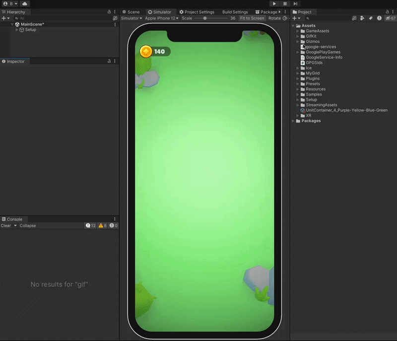

# GifKit

A lightweight GIF recorder and encoder for Unity. Capture screen frames and export animated GIFs at runtime — no third-party dependencies, no native plugins.



## Features

- Simple `StartRecording` / `FinishRecording` API
- Pure C# GIF89a encoder with LZW compression and median-cut color quantizer
- Background encoding — Unity doesn't freeze while the GIF is being built
- Configurable resolution, frame rate, and capture duration via ScriptableObject
- Works on any platform Unity supports

## Requirements

- Unity 2021.3+
- Universal Render Pipeline (URP) is included in the sample project but not required by the package

## Installation

**Via Unity Package Manager (Git URL)**

1. Open **Window → Package Manager**
2. Click **+** → **Add package from git URL**
3. Enter:
   ```
   https://github.com/bilalemregrkn/gifkit.git?path=Assets/GifKit
   ```

**Manual**

Copy the `Assets/GifKit` folder into your project's `Assets` directory.

## Quick Start

1. Add the `GifRecorder` component to a GameObject
2. Create a `GifSettings` asset (**Assets → Create → Create GifSettings**) and assign it to the recorder
3. Subscribe to `OnEncoded` and call the record methods:

```csharp
recorder.OnEncoded += bytes => File.WriteAllBytes("output.gif", bytes);

recorder.StartRecording();
// ... later ...
recorder.FinishRecording(extraDuration: 1f); // captures 1 more second, then encodes
```

The encoded GIF is delivered as a `byte[]` on the main thread — write it to disk, upload it, or do anything else.

## API

```csharp
void StartRecording()              // begin capturing frames
void StopRecording()               // stop capturing (frames are kept, not encoded)
void FinishRecording(float extra)  // capture for extra more seconds, then encode
void EncodeNow()                   // stop capturing and encode immediately

bool IsRecording
event Action<byte[]> OnEncoded     // fires on the main thread; null if no frames were captured
```

## GifSettings

| Property | Default | Description |
|---|---|---|
| `maxDimension` | 480 | Output is scaled so the longest side ≤ this value |
| `fps` | 10 | Capture frame rate |
| `extraDuration` | 1.0 | Seconds to keep recording after `FinishRecording()` is called |

## GifRecordController

An example `MonoBehaviour` showing how to wire up `GifRecorder` and save the result to disk. It saves to `Application.persistentDataPath` by default. Methods can also be called from the Inspector via **Context Menu**.

```csharp
controller.gifName  = "my-capture";
controller.savePath = "/some/path";  // leave empty for persistentDataPath

controller.StartRecord();
// ...
controller.StopRecord();
```

## License

MIT
